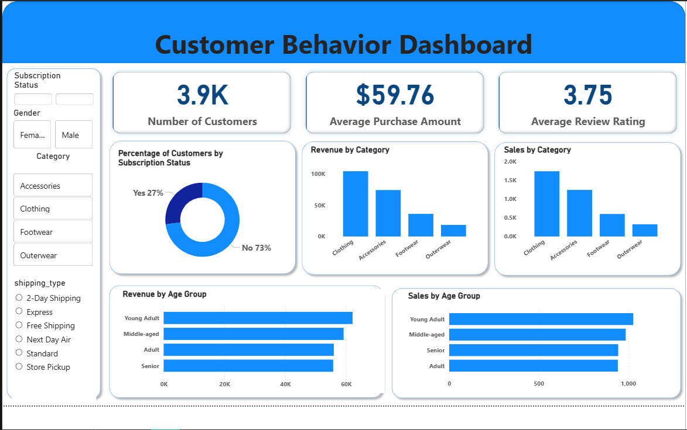

# Customer Shopping Behavior Analysis


## 📊 Project Overview

This project analyzes customer shopping behavior using transactional data from **3,900 purchases** across multiple product categories. The analysis provides actionable insights into spending patterns, customer segmentation, product preferences, and subscription trends to support data-driven strategic decision-making.

### 🎯 Business Objectives
- Identify key revenue drivers and customer spending patterns
- Analyze customer segmentation and loyalty trends
- Evaluate product performance and discount effectiveness
- Provide data-driven recommendations for business growth

## 📁 Dataset Information

- **Total Records**: 3,900 purchases
- **Total Features**: 18 variables
- **Data Quality**: 37 missing entries in Review Rating (handled during preprocessing)

### Key Variables Analyzed
- **Customer Demographics**: Age, Gender, Location, Subscription Status
- **Purchase Details**: Item Purchased, Category, Purchase Amount, Season, Size, Color
- **Shopping Behavior**: Discount Applied, Promo Code Used, Previous Purchases, Purchase Frequency, Review Rating, Shipping Type

## 🛠️ Technical Stack

- **Data Processing**: Python, Pandas
- **Database**: Microsoft SQL Server
- **Visualization**: Power BI
- **Analysis**: Statistical Analysis, Customer Segmentation

## 📋 Project Structure

```
customer-shopping-analysis/
│
├── data/
│   └── customer_shopping_data.csv
│
├── notebooks/
│   └── shopping_behavior_analysis.ipynb
│
├── sql/
│   └── business_queries.sql
│
├── powerbi/
│   └── shopping_dashboard.pbix
│
├── docs/
│   └── analysis_report.pdf
│
├── image/
│   └── Screenshot.png
│
└── README.md
```

## 🔍 Analysis Methodology

### 1. Data Preparation & Cleaning
- **Data Loading**: Imported dataset using pandas
- **Missing Values**: Imputed missing review ratings with median values per category
- **Feature Engineering**: Created age groups and purchase frequency features
- **Data Standardization**: Converted columns to snake_case format
- **Quality Checks**: Correlation analysis and redundancy removal

### 2. Exploratory Data Analysis
**Key Statistics:**
- Average Purchase Amount: $59.76
- Average Review Rating: 3.75/5.0
- Average Previous Purchases: 25.35 per customer

### 3. SQL Business Analysis
Executed comprehensive SQL queries to answer key business questions:

## 📈 Key Findings

### Revenue Insights
- **Total Revenue**: $233,081
- **Gender Distribution**: 
  - Male: $157,890 (68%)
  - Female: $75,191 (32%)

### Customer Segmentation
- **Loyal Customers**: 3,116 (80%)
- **Returning Customers**: 701 (18%)
- **New Customers**: 83 (2%)

### Product Performance
**Top Rated Products:**
1. Gloves (3.98 ⭐)
2. Sandals (3.94 ⭐) 
3. Boots (3.90 ⭐)

**Most Discount-Dependent Products:**
1. Hat (50% discount rate)
2. Sneakers (49.7% discount rate)
3. Coat (49.1% discount rate)

### Age Group Analysis
- **Young Adults**: $62,143
- **Middle-aged**: $59,197
- **Adults**: $55,978
- **Seniors**: $55,763

## 🎯 Business Recommendations

### Immediate Actions (1-4 weeks)
1. **Subscription Conversion Campaign**
   - Target 3,116 loyal non-subscribers with exclusive benefits
   - Expected: 15% conversion rate within 60 days

2. **Gender-Specific Marketing**
   - Develop targeted campaigns for male customers (68% revenue share)
   - Create personalized product bundles

3. **Discount Strategy Optimization**
   - Re-evaluate pricing for high discount-dependent products
   - Test alternative promotion strategies

### Strategic Initiatives (1-6 months)
1. **Young Adult Engagement Program**
   - Social media campaigns targeting 18-30 demographic
   - Expected: 10% revenue growth in 90 days

2. **Premium Loyalty Tier**
   - VIP program for high-spending discount users
   - Exclusive early access and benefits

## 📊 Power BI Dashboard



Developed an interactive dashboard featuring:
- Revenue trends and customer demographics
- Product performance metrics
- Customer segmentation analysis
- Real-time KPI tracking

## 🚀 How to Run This Project

### Prerequisites
```bash
Python 3.7+
MSSQL Server
Power BI Desktop
```

### Installation
```bash
# Clone repository
git clone https://github.com/duyilemi/customer-shopping-analysis.git

# Install required packages
pip install pandas numpy matplotlib seaborn sqlalchemy pyodbc
```

### Data Processing
```python
# Run the analysis notebook
jupyter notebook notebooks/shopping_behavior_analysis.ipynb
```

### SQL Analysis
```sql
-- Execute business queries
sqlcmd -S your_server -d your_database -i sql/business_queries.sql
```

## 📞 Contact

**Project Maintainer**: Charles Duyilemi  
**Email**: charlesduyilemi@gmail.com   
**LinkedIn**: https://www.linkedin.com/in/charlesolajide/

## 📄 License

This project is licensed under the MIT License - see the [LICENSE.md](LICENSE.md) file for details.


**If you found this project helpful, please give it a star!**